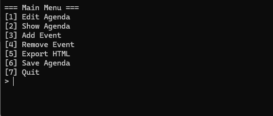
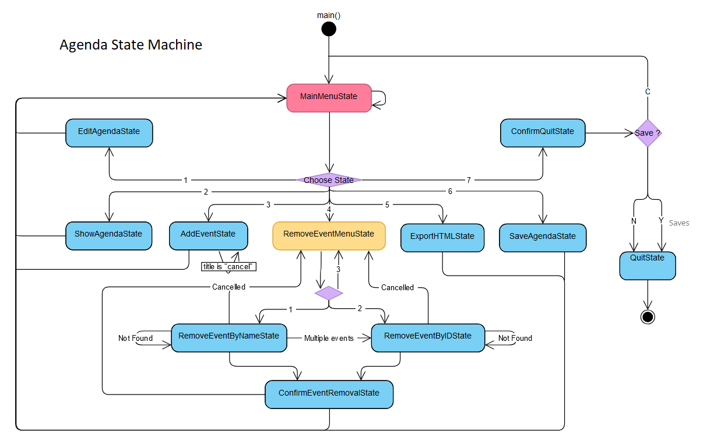

<div align="center">

<!-- Logo -->


<br/>

### *Manage your events with a powerful state machine*

<br/>

[](https://isocpp.org/)
[](https://cmake.org/)
[](/)
[](/)

<br/>

[Features](#feature-set) · [Architecture](#architecture-overview) · [Build](#build-instructions) · [Usage](#running-the-application)

---

</div>

<br/>

# AgendApp

AgendApp is a C++20 console application for managing an agenda of events. The program is built around a finite state machine that drives an interactive terminal workflow for creating, updating, browsing, and exporting agendas. Persistence is handled through plain text files stored in the user profile, and the agenda can be exported to standalone HTML for distribution.

## Screenshot

<div align="center">


*Interactive main menu interface*
</div>

## Feature set

- Agenda lifecycle: load existing agendas or bootstrap a new one when no persisted data is found.
- Event management: create events with validated date and time ranges, update agenda metadata, list entries, and remove events by title or identifier.
- HTML export: generate a self-contained HTML document that renders the agenda without external assets.
- Persistence: serialise agendas to `%APPDATA%/AgendaApp/agendas` (Windows) or `$HOME/AgendaApp/agendas` (Unix) using a custom plain text format.
- User safeguards: warn before quitting with unsaved changes and offer inline save options.

## Architecture overview

### State Machine

<div align="center">


*Finite state machine driving the application workflow*
</div>

<br/>

- `StateMachine` namespace (`include/statemachine`, `src/statemachine`): Implements the finite state machine, with each menu or action represented by its own state object. Transitions are explicit, and messages are passed between states through the machine interface.
- `Agenda` namespace (`include/Agenda`, `src/Agenda`): Aggregates agenda properties and the event list. The `Controller` orchestrates persistence, domain validation, and exposes a façade for the UI layer.
- `Events` namespace (`include/Events`, `src/Events`): Contains rich domain objects (`Event`, `EventsList`) with string, HTML, and time handling utilities.
- `Timestamp` namespace (`include/Timestamp`, `src/Timestamp`): Provides `Date` and `Time` types with parsing, validation, and formatting responsibilities.
- `Utils` module: Supplies reusable console helpers, thread-local UID generation, input validation, and ANSI-aware screen clearing for Windows and Unix terminals.
- `ResourceManager`: Centralises filesystem access, ensuring directories exist, writing agenda data, and emitting HTML exports.

The codebase follows interface-driven design (`IStringConvertible`, `IHtmlConvertible`) so that data structures expose a consistent textual representation to the CLI and exporter.

## Command-line workflow

```
AgendaApp <agenda_name>
```

- On startup, the controller loads `<agenda_name>.dat` from the agenda directory. If the file is missing, the user is prompted for an agenda title and description before continuing.
- The main menu is rendered through `MainMenuState`, dispatching to dedicated states such as `AddEventState`, `RemoveEventMenuState`, `SaveAgendaState`, or `ExportHTMLState`.
- States return control to the machine after they complete or request another transition, keeping the run loop free of menu-specific logic.

## Build instructions

### Prerequisites

- CMake ≥ 3.10
- A C++20-capable compiler (MSVC 19.3x, Clang ≥ 15, or GCC ≥ 12)

### Configure and build

Windows (PowerShell):

```powershell
cmake -S . -B build -G "Visual Studio 17 2022"
cmake --build build --config Release
```

Unix-like systems:

```bash
cmake -S . -B build -DCMAKE_BUILD_TYPE=Release
cmake --build build
```

The resulting binary is emitted to `bin/AgendaApp.exe` on Windows or `bin/AgendaApp` on Unix.

## Running the application

```powershell
# Windows
bin\AgendaApp.exe my-agenda
```

```bash
# Unix-like
./bin/AgendaApp my-agenda
```

Agenda files are saved under the configured data directory (default: `%APPDATA%/AgendaApp/agendas` or `$HOME/AgendaApp/agendas`). HTML exports are written to the sibling `html` directory.

## Data format

Agendas are persisted as plain text documents. A stripped example:

```
name: my-agenda
title: Roadmap Q2
description: Kickoff milestones
uid: 1a2b3c... 
title: Release Alpha
description:
Stabilise feature set
:endDescription
beginDate: 01/04/2025 09:00
endDate: 01/04/2025 11:00
```

Each event is bracketed by an identifier, metadata, a multi-line description terminated with `:endDescription`, and validated start/end timestamps.

## Tests

The repository ships with an Expect automation script (`tests/edit.expect`) that exercises the menu flow on Windows, ensuring the edit pipeline keeps working. Additional tests can be layered on top of the same mechanism to cover other states.

## Extensibility notes

- The state machine accepts new features by appending another state to `MainMenuState::StateFactory` and implementing the corresponding state class.
- The `ResourceManager::Config` struct can be extended to redirect agenda or HTML output directories without touching higher layers.
- Rendering logic can be redirected from HTML to other formats by adding new implementations of `IHtmlConvertible` or additional convertible interfaces.
